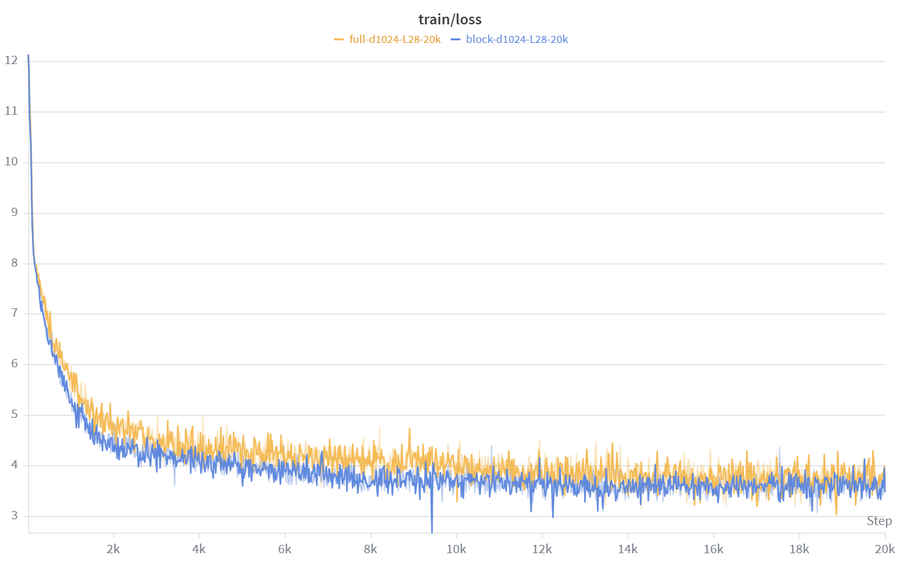
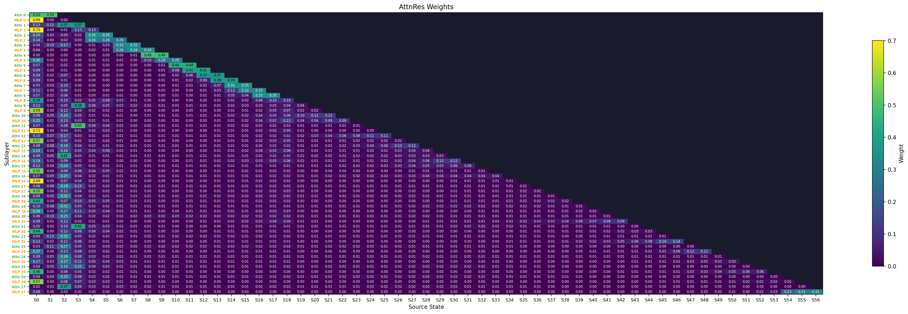

# attention-residuals-reproduction


[English](README.md) | [简体中文](README.zh-CN.md)

This project is a reproduction experiment of the Attention Residuals method
published by the Kimi team in 2026. Its core goal is to compare standard residual
connections with Attention Residuals on Qwen3-style decoder-only Transformers.

Compared with the original project, this repository focuses more on Chinese data and
Chinese evaluation scenarios. The default training data is
`opencsg/Fineweb-Edu-Chinese-V2.2`, and evaluation covers Chinese held-out
perplexity, C-Eval, and CMMLU. The implementation keeps three modes:
`baseline`, `block`, and `full`, with adaptations for streaming Chinese data,
multi-GPU DDP, batch assembly, checkpoint saving, and visualization.

<p align="center">
  
</p>

<p align="center">
  <em>Figure 1: Training loss curve for the 0.6B Block Attention Residuals model</em>
</p>

## Core Idea

Standard Transformers use additive residual connections:

```text
h_l = h_{l-1} + f_l(h_{l-1})
```

Attention Residuals replace the residual path with a learnable weighted mixture of
historical representations:

```text
h_l = sum_i alpha_{i -> l} * s_i
```

Here, `s_i` is a historical source representation, and `alpha_{i -> l}` is a
depth-wise weight obtained through softmax. Intuitively, each sublayer no longer
receives only the latest residual stream. Instead, it can selectively reuse earlier
block-level or sublayer-level representations.

<p align="center">
  
</p>

<p align="center">
  <em>Figure 2: Overview of the Attention Residuals method</em>
</p>

## Modes

- `baseline`: standard Qwen3 causal LM architecture without Attention Residuals.
- `block`: divides the network into blocks and applies depth attention over historical
  block representations. This mode has more manageable memory overhead.
- `full`: applies attention over finer-grained historical sublayers/states. It provides
  finer routing but requires more memory and compute.

## Project Details

- The training data uses the Chinese dataset `Chinese FineWeb Edu V2.2`.
- Data loading supports both `modelscope` and `huggingface`; ModelScope is used by
  default.
- In multi-GPU streaming training, samples are sharded by rank before shuffling to
  avoid excessive duplication across GPUs.
- `batch_size` is effective: the training loop stacks multiple token chunks into
  `[B, T]`.
- Training uses the standard causal LM pattern: `input_ids=batch`, `labels=batch`, and
  the model performs shifting internally.
- `use_cache=False` is set explicitly during training to avoid unnecessary cache
  memory usage.
- `DDP.no_sync()` is used during gradient accumulation to reduce gradient
  synchronization overhead on non-update steps.
- Visualization heatmaps can display weight values inside cells and distinguish
  `Source Block` from `Source State`.

## Installation

```bash
pip install -r requirements.txt
```

Main dependencies include:

- `torch`
- `transformers`
- `datasets`
- `modelscope`
- `wandb`
- `matplotlib`

## Training

### 100M Scale

```bash
# Baseline
torchrun --nproc_per_node=2 train.py \
  --mode baseline \
  --hidden_size 512 \
  --num_layers 12 \
  --num_heads 8 \
  --num_kv_heads 4 \
  --intermediate_size 1536 \
  --seq_len 2048 \
  --steps 20000 \
  --batch_size 1 \
  --grad_accum 8

# Block Attention Residuals
torchrun --nproc_per_node=2 train.py \
  --mode block \
  --hidden_size 512 \
  --num_layers 12 \
  --num_heads 8 \
  --num_kv_heads 4 \
  --intermediate_size 1536 \
  --num_blocks 4 \
  --seq_len 2048 \
  --steps 20000 \
  --batch_size 1 \
  --grad_accum 8

# Full Attention Residuals
torchrun --nproc_per_node=2 train.py \
  --mode full \
  --hidden_size 512 \
  --num_layers 12 \
  --num_heads 8 \
  --num_kv_heads 4 \
  --intermediate_size 1536 \
  --seq_len 2048 \
  --steps 20000 \
  --batch_size 1 \
  --grad_accum 8
```

### 0.6B Scale

The 0.6B configuration follows the main structure of Qwen3-0.6B:

```text
d=1024, L=28, heads=16, kv_heads=8, ff=3072
```

```bash
# Baseline
torchrun --nproc_per_node=2 train.py \
  --mode baseline \
  --hidden_size 1024 \
  --num_layers 28 \
  --num_heads 16 \
  --num_kv_heads 8 \
  --intermediate_size 3072 \
  --seq_len 2048 \
  --steps 20000 \
  --batch_size 1 \
  --grad_accum 8 \
  --lr 6e-4 \
  --lr_min 6e-5 \
  --save_every 50000

# Block Attention Residuals
torchrun --nproc_per_node=2 train.py \
  --mode block \
  --hidden_size 1024 \
  --num_layers 28 \
  --num_heads 16 \
  --num_kv_heads 8 \
  --intermediate_size 3072 \
  --num_blocks 8 \
  --seq_len 2048 \
  --steps 20000 \
  --batch_size 1 \
  --grad_accum 8 \
  --lr 6e-4 \
  --lr_min 6e-5 \
  --save_every 50000
```

The `full` mode has high memory pressure at 0.6B with `seq_len=2048`. If training
with DDP on 24GB or 32GB GPUs, you may need to reduce `seq_len` or use memory-saving
techniques such as gradient checkpointing, FSDP, or ZeRO.

## Evaluation

```bash
# Baseline
python eval.py --model_path output/scratch-baseline-d512-L12-20k/final --mode baseline

# Block Attention Residuals
python eval.py --model_path output/scratch-block-d512-L12-20k/final --mode block

# Full Attention Residuals
python eval.py --model_path output/scratch-full-d512-L12-20k/final --mode full
```

Evaluation includes:

- Chinese held-out perplexity
- C-Eval accuracy
- CMMLU accuracy

By default, evaluation skips an initial portion of the Chinese training stream for
held-out perplexity estimation and runs few-shot multiple-choice evaluation on a
subset of C-Eval and CMMLU subjects.

## Results

### 100M Model

| Model | Chinese Held-out PPL | C-Eval Acc | CMMLU Acc |
|-------|----------------------|------------|-----------|
| Baseline (Standard Residual) | 128.58 | 0.2664 | 0.2594 |
| Full Attention Residuals | 104.51 | 0.2969 | 0.2375 |
| Block Attention Residuals | 105.09 | 0.2969 | 0.2469 |

<p align="center">
  
</p>

<p align="center">
  <em>Figure 3: Training loss comparison between Block Attention Residuals and the baseline at the 100M scale</em>
</p>

<p align="center">
  
</p>

<p align="center">
  <em>Figure 4: Training loss comparison between Block Attention Residuals and Full Attention Residuals at the 100M scale</em>
</p>

### 0.6B Model

| Model | Chinese Held-out PPL | C-Eval Acc | CMMLU Acc |
|-------|----------------------|------------|-----------|
| Baseline (Standard Residual) | 41.83 | 0.2533 | 0.2656 |
| Full Attention Residuals | 57.34 | 0.2926 | 0.2188 |
| Block Attention Residuals | 38.80 | 0.2620 | 0.2625 |

For the 0.6B experiments, `baseline` and `block` use `seq_len=2048`. Because of
memory constraints, `full` is better recorded as a separate supplementary
`seq_len=1024` experiment instead of being compared directly against the
`seq_len=2048` results.

<p align="center">
  
</p>

<p align="center">
  <em>Figure 5: Training loss comparison between Block Attention Residuals and the baseline at the 0.6B scale</em>
</p>

<p align="center">
  
</p>

<p align="center">
  <em>Figure 6: Training loss comparison between Block Attention Residuals and Full Attention Residuals at the 0.6B scale</em>
</p>


## Visualization

```bash
python visualize.py \
  --model_path output/scratch-block-d512-L12-20k/final \
  --mode block \
  --num_texts 3 \
  --out_dir ./output/visualizations
```

<p align="center">
  
</p>

<p align="center">
  <em>Figure 7: Layer dependency heatmap for the 0.6B Block Attention Residuals model (`block` mode)</em>
</p>

<p align="center">
  
</p>

<p align="center">
  <em>Figure 8: Layer dependency heatmap for the 0.6B Full Attention Residuals model (`full` mode)</em>
</p>

In the heatmap, the y-axis represents sublayers, such as `Attn 0` and `MLP 0`. The
x-axis represents source blocks in `block` mode, such as `B0` to `B7`, and source
states in `full` mode, such as `S0` and `S1`. The number inside each cell is the
average AttnRes weight from that source to the current sublayer.

## Checkpoints

During training, `save_every` controls whether intermediate `step-*` models are
saved. The current `step-*` directories only save model weights and tokenizer files;
they do not include optimizer state, scheduler state, global step, or other full
training-resume metadata.

If you only need the final model, set:

```bash
--save_every 50000
```

When `steps=20000`, this saves only `final` at the end of training and reduces disk
usage.

## Known Limitations

- The current training script uses DDP. Each GPU keeps a full model replica, so the
  memory of two GPUs is not combined into one larger model memory pool.
- `full` mode has significantly higher memory pressure than `block` and `baseline`
  at longer sequence lengths.
- Intermediate checkpoints cannot currently be used for strict training resumption.
- Chinese evaluation results for the 0.6B `full` mode still need to be completed under
  a unified setup or clearly documented supplementary setup.

## Pretrained Weights

| Model | Link |
|-------|------|
| 100M Baseline | [attention-residuals-100M-baseline](https://huggingface.co/Ethangou/attention-residuals-100M-baseline) |
| 100M Block Attention Residuals | [attention-residuals-100M-block](https://huggingface.co/Ethangou/attention-residuals-100M-block) |
| 100M Full Attention Residuals | [attention-residuals-100M-full](https://huggingface.co/Ethangou/attention-residuals-100M-full) |
| 0.6B Baseline | [attention-residuals-0.6B-baseline](https://huggingface.co/Ethangou/attention-residuals-0.6B-baseline) |
| 0.6B Block Attention Residuals | [attention-residuals-0.6B-block](https://huggingface.co/Ethangou/attention-residuals-0.6B-block) |
| 0.6B Full Attention Residuals | [attention-residuals-0.6B-full](https://huggingface.co/Ethangou/attention-residuals-0.6B-full) |

## Findings

1. **At the 100M scale, Attention Residuals clearly improve language-modeling quality
   over the baseline.** `full` and `block` reach Chinese held-out PPL values of 104.51
   and 105.09, both substantially below the baseline score of 128.58. Both variants
   also improve C-Eval to 0.2969, above the baseline's 0.2664.

2. **Block AttnRes remains the most robust and scalable variant in the current setup.**
   At the 0.6B scale, `block` reduces PPL from 41.83 to 38.80 while keeping
   `seq_len=2048`, and it also improves C-Eval from 0.2533 to 0.2620. CMMLU stays
   close to the baseline at 0.2625 versus 0.2656. Taken together with the training
   curves and lower memory overhead, `block` is still the first variant to try when
   scaling to larger models or longer sequences.

3. **Full AttnRes is more sensitive to the experimental setup and is best interpreted
   as a supplementary result at 0.6B.** At 100M, `full` achieves the best PPL. At
   0.6B, however, the recorded `full` run uses the supplementary `seq_len=1024`
   setting rather than the same `seq_len=2048` setup used by `baseline` and `block`.
   It reaches the highest C-Eval score in the table at 0.2926, but its PPL is 57.34
   and its CMMLU is 0.2188, so it should not be read as a direct like-for-like win
   over the other two variants.

4. **The gains are metric-dependent rather than uniform across all evaluations.**
   Held-out PPL shows the clearest and most stable benefit from Attention Residuals.
   C-Eval also improves at both scales, with especially strong performance in the
   supplementary `0.6B full` run. CMMLU, however, does not improve consistently,
   suggesting that downstream multiple-choice performance is still sensitive to
   training length, data, and a fully unified evaluation setup.

## Acknowledgements

- [Attention Residuals](https://arxiv.org/abs/2603.15031)
- [Qwen3](https://arxiv.org/abs/2505.09388)
