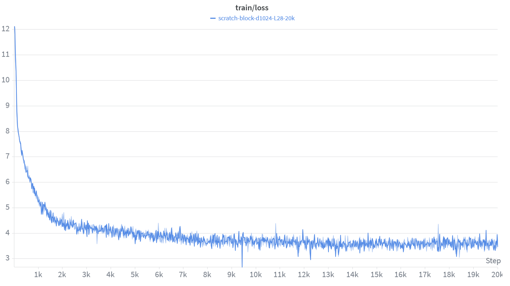
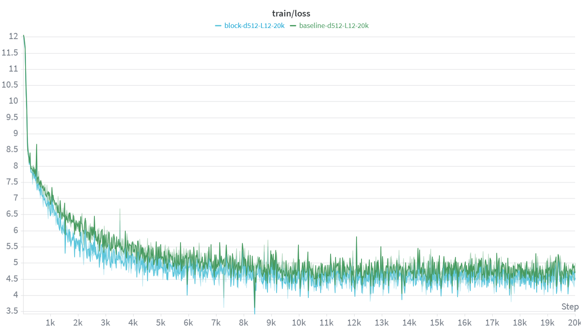
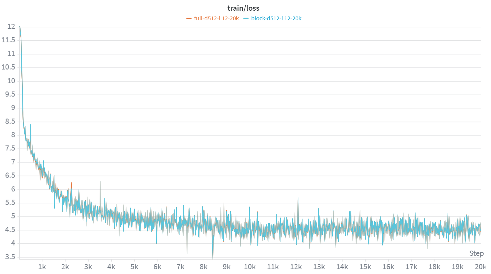
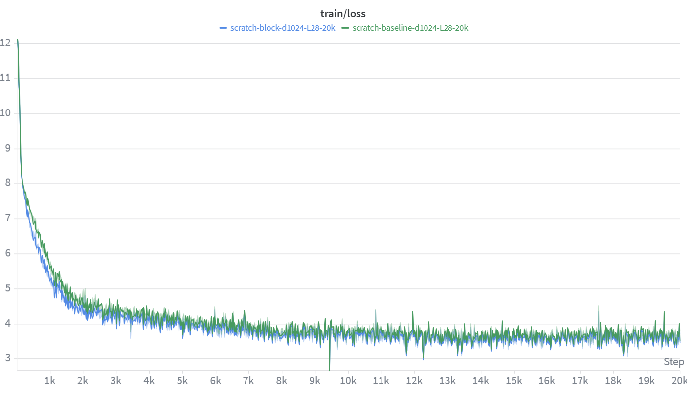
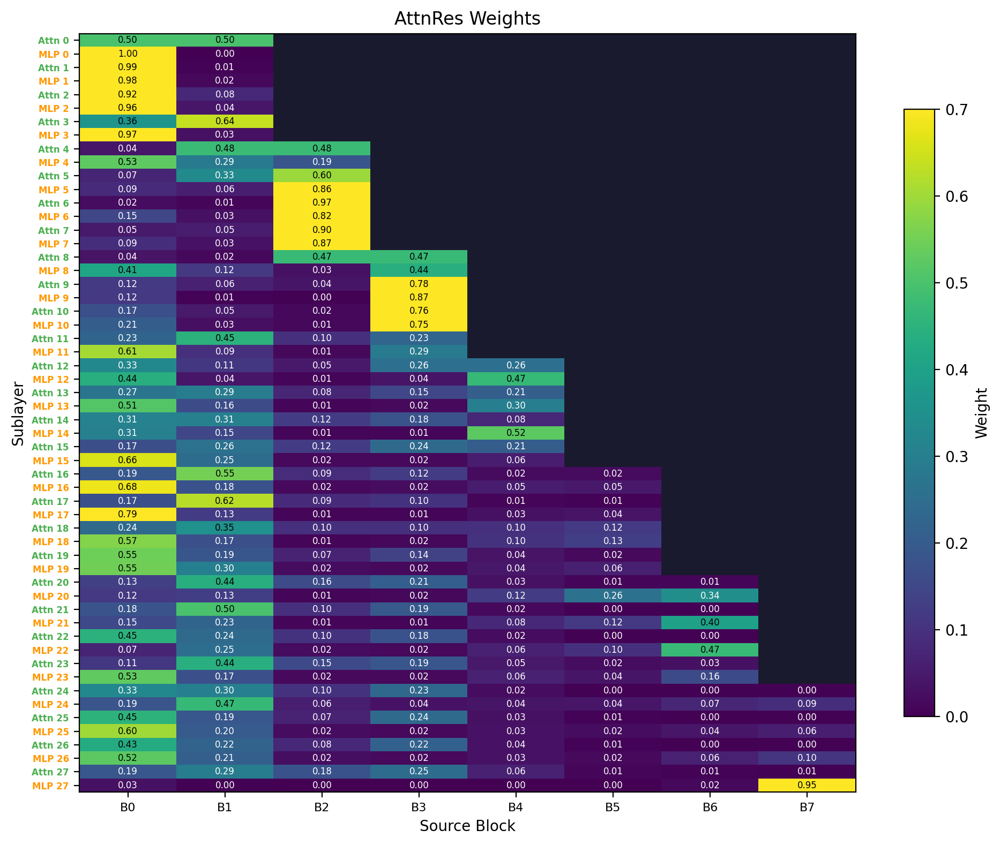

# attention-residuals-reproduction

[English](README.md) | [简体中文](README.zh-CN.md)

本项目是对 Kimi 团队在2026年发表的 Attention Residuals 文章方法的复现实验，核心目标是在
Qwen3 风格的 decoder-only Transformer 上比较标准残差连接与 Attention Residuals 的差异。

与原项目相比，本项目更侧重中文数据和中文评测场景：训练数据默认使用
`opencsg/Fineweb-Edu-Chinese-V2.2`，评测包含中文 held-out perplexity、C-Eval 和 CMMLU。
实现上保留了 `baseline`、`block`、`full` 三种模式，并针对流式中文数据、多卡 DDP、batch
组装、checkpoint 保存和可视化输出做了适配。

<p align="center">
  
</p>

## 核心思想

标准 Transformer 使用加法残差连接：

```text
h_l = h_{l-1} + f_l(h_{l-1})
```

Attention Residuals 将残差路径改成对历史表示的可学习加权混合：

```text
h_l = sum_i alpha_{i -> l} * s_i
```

其中 `s_i` 是历史 source representation，`alpha_{i -> l}` 是通过 softmax 得到的深度方向权重。
直观上，每个子层不再只能接收最近一层的残差流，而是可以选择性复用更早的 block 或 sublayer
表示。

## 模式

- `baseline`: 标准 Qwen3 causal LM 结构，不使用 Attention Residuals。
- `block`: 将网络划分成若干 block，在 block 级别对历史表示做深度 attention。该模式显存开销较可控。
- `full`: 对更细粒度的历史 sublayer/state 做 attention，路由更细，但显存和计算开销更高。

## 项目细节

- 训练数据使用中文数据集 `Chinese FineWeb Edu V2.2 `。
- 数据加载支持 `modelscope` 和 `huggingface` 两种来源，默认使用 ModelScope。
- 多卡流式训练中先按 rank 分片，再 shuffle，避免不同 GPU 读取大量重复样本。
- `batch_size` 已实际生效：训练循环会把多个 token chunk stack 成 `[B, T]`。
- 使用标准 causal LM 训练写法：`input_ids=batch`，`labels=batch`，由模型内部完成 shift。
- 训练时显式设置 `use_cache=False`，避免无意义的 cache 显存开销。
- 梯度累积时使用 `DDP.no_sync()` 减少非更新步的梯度同步开销。
- 可视化热图支持在方块中显示权重数值，并区分 `Source Block` 与 `Source State`。

## 环境安装

```bash
pip install -r requirements.txt
```

主要依赖包括：

- `torch`
- `transformers`
- `datasets`
- `modelscope`
- `wandb`
- `matplotlib`
- `gradio`

## 训练

### 100M 规模

```bash
# Baseline
torchrun --nproc_per_node=2 train.py \
  --mode baseline \
  --hidden_size 512 \
  --num_layers 12 \
  --num_heads 8 \
  --num_kv_heads 4 \
  --intermediate_size 1536 \
  --seq_len 2048 \
  --steps 20000 \
  --batch_size 1 \
  --grad_accum 8

# Block Attention Residuals
torchrun --nproc_per_node=2 train.py \
  --mode block \
  --hidden_size 512 \
  --num_layers 12 \
  --num_heads 8 \
  --num_kv_heads 4 \
  --intermediate_size 1536 \
  --num_blocks 4 \
  --seq_len 2048 \
  --steps 20000 \
  --batch_size 1 \
  --grad_accum 8

# Full Attention Residuals
torchrun --nproc_per_node=2 train.py \
  --mode full \
  --hidden_size 512 \
  --num_layers 12 \
  --num_heads 8 \
  --num_kv_heads 4 \
  --intermediate_size 1536 \
  --seq_len 2048 \
  --steps 20000 \
  --batch_size 1 \
  --grad_accum 8
```

### 0.6B 规模

0.6B 配置对齐 Qwen3-0.6B 的主体结构：

```text
d=1024, L=28, heads=16, kv_heads=8, ff=3072
```

```bash
# Baseline
torchrun --nproc_per_node=2 train.py \
  --mode baseline \
  --hidden_size 1024 \
  --num_layers 28 \
  --num_heads 16 \
  --num_kv_heads 8 \
  --intermediate_size 3072 \
  --seq_len 2048 \
  --steps 20000 \
  --batch_size 1 \
  --grad_accum 8 \
  --lr 6e-4 \
  --lr_min 6e-5 \
  --save_every 50000

# Block Attention Residuals
torchrun --nproc_per_node=2 train.py \
  --mode block \
  --hidden_size 1024 \
  --num_layers 28 \
  --num_heads 16 \
  --num_kv_heads 8 \
  --intermediate_size 3072 \
  --num_blocks 8 \
  --seq_len 2048 \
  --steps 20000 \
  --batch_size 1 \
  --grad_accum 8 \
  --lr 6e-4 \
  --lr_min 6e-5 \
  --save_every 50000
```

`full` 模式在 0.6B、`seq_len=2048` 下显存压力较高。若使用 24GB/32GB 单卡副本的 DDP
训练，可能需要降低 `seq_len` 或使用 gradient checkpointing、FSDP/ZeRO 等显存优化手段。

## 评测

```bash
# Baseline
python eval.py --model_path output/scratch-baseline-d512-L12-20k/final --mode baseline

# Block Attention Residuals
python eval.py --model_path output/scratch-block-d512-L12-20k/final --mode block

# Full Attention Residuals
python eval.py --model_path output/scratch-full-d512-L12-20k/final --mode full
```

评测内容包括：

- Chinese held-out perplexity
- C-Eval accuracy
- CMMLU accuracy

默认评测配置会从中文训练数据中跳过前若干样本作为 held-out perplexity 估计，并在 C-Eval /
CMMLU 的部分 subject 上做 few-shot 多选题评测。

## 实验结果

### 100M 模型

| Model | Chinese Held-out PPL | C-Eval Acc | CMMLU Acc |
|-------|----------------------|------------|-----------|
| Baseline (Standard Residual) | 128.58 | 0.2664 | 0.2594 |
| Full Attention Residuals | 104.51 | 0.2969 | 0.2375 |
| Block Attention Residuals | 105.09 | 0.2969 | 0.2469 |

<p align="center">
  
</p>

<p align="center">
  
</p>

### 0.6B 模型

| Model | Chinese Held-out PPL | C-Eval Acc | CMMLU Acc |
|-------|----------------------|------------|-----------|
| Baseline (Standard Residual) | 41.83 | 0.2533 | 0.2656 |
| Block Attention Residuals | 38.80 | 0.2620 | 0.2625 |
| Full Attention Residuals | 待补充 | 待补充 | 待补充 |

0.6B 实验中，`baseline` 和 `block` 使用 `seq_len=2048`。`full` 模式因显存限制，建议作为
`seq_len=1024` 的补充实验单独记录，避免和 `seq_len=2048` 的结果直接横向比较。

<p align="center">
  
</p>

## 可视化
```bash
python visualize.py \
  --model_path output/scratch-block-d512-L12-20k/final \
  --mode block \
  --num_texts 3 \
  --out_dir ./output/visualizations
```

<p align="center">
  
</p>


热图中的纵轴表示子层，例如 `Attn 0`、`MLP 0`。横轴在 `block` 模式下表示 source block，
例如 `B0` 到 `B7`；在 `full` 模式下表示 source state，例如 `S0`、`S1`。方块中的数字是该
source 对当前子层的平均 AttnRes 权重。

## Checkpoint 说明

训练过程中，`save_every` 会控制是否保存 `step-*` 中间模型。当前脚本的 `step-*` 目录只保存
模型权重和 tokenizer，不包含 optimizer、scheduler、global step 等完整恢复训练所需状态。

如果只需要最终模型，可以在训练时设置：

```bash
--save_every 50000
```

当 `steps=20000` 时，这样只会在训练结束后保存 `final`，减少磁盘占用。

## 已知限制

- 当前训练脚本使用 DDP，每张 GPU 保存一份完整模型副本，并不会把两张卡显存拼成一张更大的显存。
- `full` 模式在较长 `seq_len` 下显存压力明显高于 `block` 和 `baseline`。
- 当前中间 checkpoint 不能严格用于断点续训。
- 0.6B full 模式的中文评测结果仍需在统一设置或明确补充设置下补齐。

## 致谢

- [Attention Residuals](https://arxiv.org/abs/2603.15031)
- [Qwen3](https://arxiv.org/abs/2505.09388)
